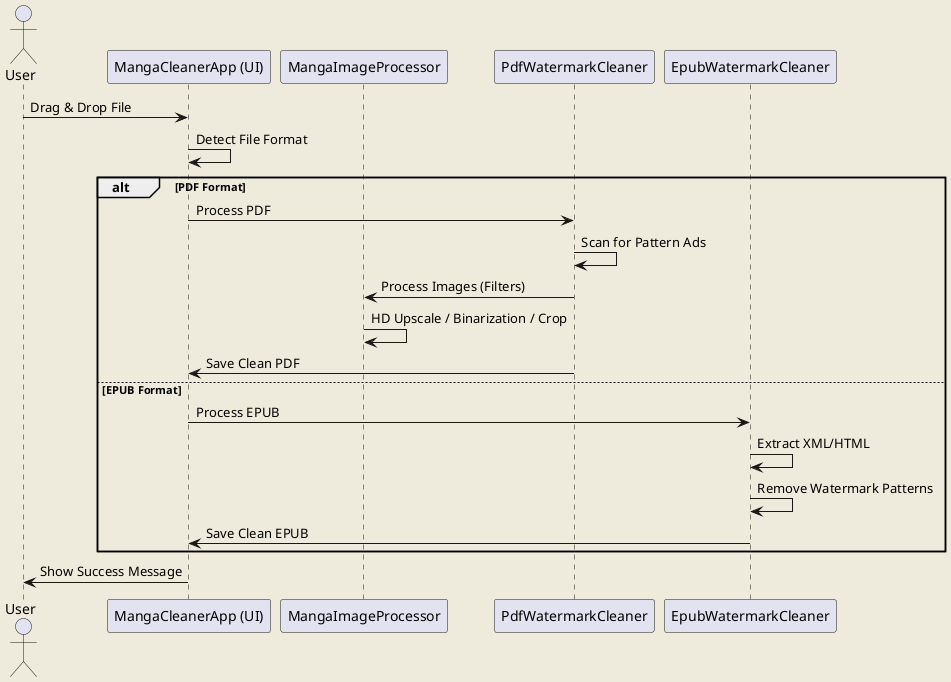

# 📚 Manga & Book Cleaner v17

<p align="center">
  
  
  
</p>

---

## 📖 Описание
**Manga Cleaner** — это интеллектуальный инструмент для подготовки манги и книг к комфортному чтению на электронных ридерах (Kindle, PocketBook и др.). Программа не просто меняет размер, она **чистит** контент от мусора.

---

## ⚡ Ключевые фишки

### 🧠 Smart Pattern Eraser (PDF)
Самая мощная функция проекта. Если в вашей манге через каждую страницу вставлена реклама (например, от *oceanofpdf*):
1. Программа анализирует первые страницы.
2. При обнаружении цикличной рекламы (паттерна) включается **Turbo Mode**.
3. Рекламные страницы вырезаются автоматически на уровне алгоритма без задержек на чтение текста.

### 🛠 Обработка изображений
* **HD Upscaling:** Увеличение разрешения в 1.5x с использованием бикубической интерполяции для четкости линий.
* **Smart Crop:** Автоматическое удаление пустых полей (кроп) для максимизации области чтения.
* **Binarization:** Оптимизация под E-Ink дисплеи (высокий контраст).

### 📑 Поддержка EPUB
* Мгновенная очистка текстовых водяных знаков внутри структуры книги.
* Сохранение оригинальных метаданных и обложек.

---

## 🚀 Быстрый старт

### Требования
* **Java 17+**
* **Maven** (для управления зависимостями)

### Установка
```bash
git clone [https://github.com/ваш-аккаунт/manga-cleaner.git](https://github.com/ваш-аккаунт/manga-cleaner.git)
cd manga-cleaner
mvn clean install
```

## 📚 Примеры книг
В папке `BookExample(NO_USE)` находятся примеры файлов для демонстрации работы программы. 
> **Внимание:** Эти файлы предоставлены исключительно для ознакомления с функционалом. Пожалуйста, ознакомьтесь с [warning.md](BookExample(NO_USE)/warnin.md).

---

## 🖼️ Визуализация

### 🔄 До и После (Очистка водяных знаков)
| Оригинал (с рекламой/водяными знаками) | После обработки (чистая страница) |
| :---: | :---: |
|  |  |

---

## 📊 Схема работы
Ниже представлена диаграмма процесса обработки документа в приложении:


### PlantUML (Код диаграммы)
<details>
<summary>Показать код PlantUML</summary>


</details>

---

## 🛠️ Стек технологий
* **Java 17**
* **FlatLaf** (Modern UI)
* **iText / PDFBox** (PDF processing)
* **ImageIO** (Image filters)
